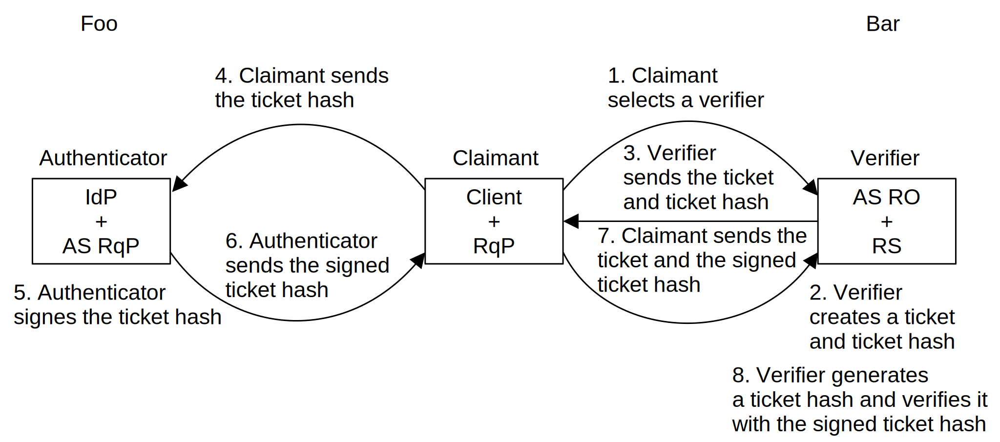
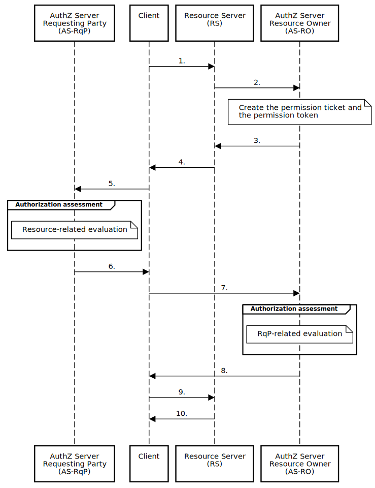
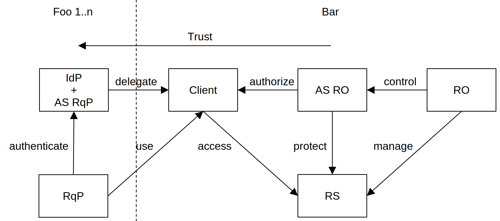
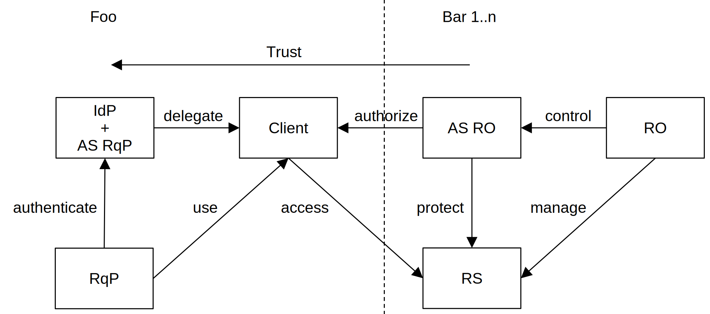

<!-- @import "style.less" -->

# Correlated Authorization—Draft

    Igor Zboran 
    izboran@gmail.com

&emsp;<strong><em>Abstract</em></strong>—Correlated Authorization is used to build trust between security domains during the conveyance of user information from the identity provider to the authorization server.

&emsp;This paper introduces Correlated Authorization as a dual-authority trust framework built on top of User-Managed Access (UMA) [1, 2] and OAuth 2.0 [3] protocols that allow users (resource owners) to delegate access to other users (requesting parties) across security domain boundaries. The requesting party is responsible for creating the request, while the resource owner approves this request either when it is online or by creating a policy. The resource owner and the requesting party may belong to different security domains administered by the respective authorities.

&emsp;The proposed concept uses a permission ticket issued by the resource owner's authorization server as a correlation handle that binds the requesting party's claims to the authorization process. An email address is used as the unique requesting party identifier. The requesting party authenticates to the resource owner's authorization server using a challenge-response authentication protocol, while the push-pull mechanism elevates trust between the respective authorities. On the requesting party side, Correlated Authorization uses the token exchange extension of OAuth 2.0 protocol [4] as a counterpart to the UMA protocol.

&emsp;Given these capabilities, Correlated Authorization is becoming an essential enabler of email infrastructure modernization.

## I. Introduction

&emsp;With the growing popularity of protocols based on the OAuth 2.0 [3] specification, there is a need for an interoperable standard that specifies how to convey information about the user from an identity provider to an authorization server, especially across security domain boundaries. The problem is that such a system is difficult to design because OAuth 2.0 [3], OIDC [5], and UMA are single-authority protocols. This draft profiles and combines the OAuth 2.0 and UMA protocols into a dual-authority framework, which not only meets the needs of interoperability but also elevates trust between mutually unknown parties.

## II. Motivation

&emsp;Correlated Authorization is an attempt to revive UMA WG's original idea—UMA wide ecosystem [6] when the resource owner and the requesting party might "know each other" in the real world, but the resource owner's authorization server has no pre-established trust with the requesting party or any of their identity/claims providers—in other words when the resource owner's authorization server and requesting party's identity provider do not know each other.

## III. UMA Wide Ecosystem Concept

&emsp;This high-level view illustrated in Figure&nbsp;1 gives you an idea of relationships between UMA wide ecosystem entities.

UMA uses special jargon. For the sake of brevity of this paper, the following list of acronyms will be used:

* IdP - Identity Provider
* AS - Authorization Server
* RS - Resource Server
* RO - Resource Owner
* RqP - Requesting Party
* RPT - Requesting Party Token

Fig.&nbsp;1.&emsp;Relationships between UMA wide ecosystem entities

The UMA wide ecosystem concept uses relationship-driven policies to drive automated dual-authority authorization assessment and token issuance. The relationship-driven policies incorporate user-to-user (U2U) relationships and user-to-resource (U2R) relationships.

## IV. Challenge-Response Authentication Protocol

&emsp;Figure&nbsp;2 shows the unilateral entity authentication protocol [7] adapted for the Correlated Authorization framework that links an authenticator with the verifier through the client and allows the claimant to convey identity information to the verifier.

Fig.&nbsp;2.&emsp;Unilateral entity authentication protocol

&emsp;Successful completion of steps means that the claimant has authenticated himself to the verifier. The ticket represents the random challenge, and the signed ticket hash represents the response. Ticket hash is used here to ensure that the actual value of the ticket is not disclosed to the authenticator.

## V. Sequence Diagram

&emsp;The following sequence diagram describes the mechanism and policies of the Correlated Authorization framework, which utilizes the UMA protocol with the token exchange extension of OAuth 2.0 [4], where an access token is used to obtain a claims token from the Security Token Service (STS) endpoint.

#### *UMA Profile*

&emsp;The sequence diagramA more detailed diagram is shown on the last page. illustrated in Figure&nbsp;3 represents a profile of the UMA protocol and is in full compliance with the UMA 2.0 specificationUnlike the UMA specification, the Correlated Authorization framework allows the use of the UMA grant with or without client authentication or identification. Whether or not to allow unauthenticated or unidentified clients are policy decisions that are at the discretion of the authorization server..

Fig.&nbsp;3.&emsp;Correlated Authorization sequence diagram

Prerequisites:

* The AS-RqP supports the OAuth 2.0 Token Exchange [4] extension of OAuth 2.0.
* The AS-RqP publishes its metadata on a URL /.well-known/oauth-authorization-server (alternatively on /.well-known/openid-configuration).
* The AS-RqP also acts as RqP's Identity Provider.
* The client is registered at the AS-RqP as a public or confidential client and acts as a Relying Party in an RqP's Identity Provider in order to obtain an access token with user claims.
* The client should be registered at the AS-RO as a public or confidential client; in case of immediate access, the client does not have to be registered at the AS-RO.
* The RO has set up the RS and registers his resource at the AS-RO to get his resource_uri according to the UMA Federated Authorization [2] specification.

Steps:

1. The RqP directs the client to access the resource_uri, e.g. to get or post data, with no access token.
2. The RS requests a permission ticket. <dl><dt></dt><dd>The AS generates the permission ticket itself (ticket is a random NONCE) and the permission token The permission token is not mentioned in the UMA specification. A detailed description of the permission token format is out of the scope of this paper., which is bound to the permission ticket through a permission ticket hash. The permission token contains these claims:&nbsp;{issuer,&nbsp;ts,&nbsp;rs_uri,&nbsp;resource_uri_hash,&nbsp;permission_ticket_hash} where  
-&nbsp;issuer is the URI that identifies who issues the permission token  
-&nbsp;ts is the timestamp of when the permission ticket was created  
-&nbsp;audience is the URI that identifies the resource server  
-&nbsp;resource_uri_hash</em>&nbsp;=&nbsp;Base64URL-Encode(SHA256(resource_uri))  
-&nbsp;permission_ticket_hash</em>&nbsp;=&nbsp;Base64URL-Encode(SHA256(permission_ticket))</dd></dl>
3. The AS returns the permission ticket and the permission token.
4. Without an access token, the RS will return HTTP code 401 (Unauthorized) with the permission ticket and the permission token.
5. The client requests a claims token by presenting the access token with user claims, permission token, and resource URI (token exchange request). <dl><dt></dt><dd>{grant_type&nbsp;=&nbsp;token-exchange,
&nbsp;resource&nbsp;=&nbsp;resource_uri,
&nbsp;scope&nbsp;=&nbsp;permission_token
&nbsp;subject_token&nbsp;=&nbsp;access_token_with_user_claims,
&nbsp;subject_token_type&nbsp;=&nbsp;urn:ietf:params:oauth:token-type:access_token,
&nbsp;requested_token_type&nbsp;=&nbsp;urn:ietf:params:oauth:token-type:jwt} 
The AS-RqP performs an authorization assessment
-&nbsp;1.&nbsp;verify permission_token signature
-&nbsp;2.&nbsp;extract resource_uri_hash claim from permission_token
-&nbsp;3.&nbsp;compare resource_uri_hash vs. Base64URL-Encode(SHA256(resource_uri))
-&nbsp;4.&nbsp;evaluate issuer, ts, audience, resource_uri 
The AS-RqP generates the claim token, which contains these claims:&nbsp;{user_claims,&nbsp;permission_ticket_hash} where
-&nbsp;user_claims are extracted from access_token_with_user_claims
-&nbsp;permission_ticket_hash is extracted from permission_token</dd></dl>
6. After an authorization assessment, it is positive, the AS-RqP returns the claims token.
7. At the AS-RO the client requests an RPT by presenting the claims token and the permission ticket. <dl><dt></dt><dd>{grant_type = uma-ticket,
&nbsp;pushed_claims = claims_token} 
The AS-RO performs an authorization assessment
&nbsp;1.&nbsp;verify permission_ticket
&nbsp;2.&nbsp;extract user_claims from claims_token
&nbsp;3.&nbsp;select email_address claim
&nbsp;4.&nbsp;bootstrap discovery of AS-RqP config url from email address via WebFinger; if this does not work, build well-known url using domain part of email_address
&nbsp;5.&nbsp;verify claims_token signature
&nbsp;6.&nbsp;evaluate resource_uri
&nbsp;7.&nbsp;extract permission_ticket_hash claim from claims_token
&nbsp;8.&nbsp;compare permission_ticket_hash vs. Base64URL-Encode(SHA256(permission_ticket))
&nbsp;9.&nbsp;evaluate user_claims</dd></dl>
8. After an authorization assessment, it is positive, the AS-RO returns RPT.
9. With the valid RPT the client tries to access the resource_uri e.g., to get or post data.
10. The RS validates the RPT; it is valid, the RS allows access to the protected resource.

## VI. Push-Pull Trust Elevation

&emsp;It is recommended to use a push-pull mechanism to increase trust. It means that the resource owner first sends a link In general, the link to shared resources may be transferred to the requesting party through any trusted channel, e.g., using store-and-forward systems such as the mail system that uses the push—fire-and-forget Simple Mail Transfer Protocol (SMTP). In any case, the shared resource URI should contain a random string. to their shared resources to the requesting party. To do this, the requesting party must have its resource server registered at its authorization server, and needs to have its resource server accessible in the form of a well-known resource_uri, e.g., mailto:john.doe@example.com for anyone. Here, the requesting party also acts as the resource owner of his resource server. After receiving the resource link, the requesting party's authorization server must set the policy correctly, either by the requesting party itself or automatically by the agent. Only then can the requesting party download the resources from the resource owner's resource server. Such a push-pull mechanism elevates trust between the resource owner's authoritative domain and requesting party's authoritative domain. By placing untrusted resource servers on a blocklist, the requesting party's authorization server may refuse to issue the claims token that, having been exchanged for an access token, is used to gain access to the resource owner's resources.

## VII. Compatibility with Mail System

&emsp;The Correlated Authorization push-pull communications mechanism forms the basis of a specific network topology that allows nodes to be organized in such a way that push data transfer can use a different route than pull data transfer. In other words, the sender can push a URI of its email resources—which may reside on any sender's resource server—to the recipient's mailbox, where in the follow-up operation, the recipient downloads the email resources to any of its resource servers. What exactly this means is described in detail in the paper Authorization-Enhanced Mail System [8].

&emsp;Generally speaking, the push-pull trust elevation mechanism can utilize existing email infrastructure, or a new secure web-based communication infrastructure needs to be built based on Correlated Authorization itself. The new-built infrastructure should mirror existing email infrastructure.

## VIII. Authority Boundaries, Interactions, and Scenarios

&emsp;The Correlated Authorization framework allows us to indirectly (through the client) link identity providers with authorization servers governed by different authorities that are not required to share information or collaborate. The following scenarios demonstrate a system of trust between multiple authorities that allows the conveyance of identity information from identity providers to authorization servers across the security domain boundaries.

#### *A. Identity Federation Scenario*

&emsp;The scenario illustrated in Figure&nbsp;4 allows you to link a single authorization server to multiple identity providers. The client falls under the governance of the resource owner's respective authority.

Fig.&nbsp;4.&emsp;Identity federation scenario

&emsp;The identity federation with many-to-one topology uses third-party identity providers. The requesting party can operate across resource servers governed by a single resource owner's respective authority. The push-pull trust elevation mechanism is not applicable in this scenario.

#### *B. Data Federation Scenario*

&emsp;The data federation scenario illustrated in Figure&nbsp;5 allows you to link a single identity provider to multiple authorization servers. The client falls under the governance of the requesting party's respective authority.

Fig.&nbsp;5.&emsp;Data federation scenario

&emsp;The data federation with one-to-many topology uses third-party authorization servers. The requesting party can operate across many resource servers, each of which is governed by a different respective authority of resource owners.

#### *C. Mesh Federation Scenario*

&emsp;As the name suggests, the scenario illustrated in Figure&nbsp;6 allows multiple authorization servers to be linked to multiple identity providers. The client does not fall under the governance of the resource owner's respective authority nor the requesting party's respective authority.

Fig.&nbsp;6.&emsp;Mesh federation scenario

&emsp;The mesh federation with many-to-many topology uses third-party identity providers and third-party authorization servers. The requesting party can operate across many resource servers governed by many resource owners' respective authorities.

## IX. Use Cases

&emsp;Secure cross-domain data exchange systems. In particular, Authorization-Enhanced Mail System [8]. Furthermore, file sharing, instant messaging, teleconferencing. Also, Healthcare systems, Fintech, and Telco services.

## X. Conclusion and Future Work

&emsp;The UMA philosophy of the resource owner and the requesting party projected onto the Correlated Authorization trust framework matches the philosophy of the sender and recipient of the mail system. In fact, the Correlated Authorization concept has been designed with the Authorization-Enhanced Mail System [8] in mind. The following are potential future R&D areas:

1. Define relationship-driven policies—user-to-user and user-to-resource relationships.
2. Provide more details on the push-pull mechanism.
3. Explore other ways of data origin authenticity (WebFinger, DKIM). Use the DKIM signed email in a claims token as an expedient way to convey some asserted attributes about the sender (alternatively, after forwarding, about the recipient also).

&emsp;A prototype implementation of the proposed framework, working as a proof of concept, would be interesting to build.

## Acknowledgment

&emsp;This work has benefited from the valuable discussions with Eve Maler, founder of WG-UMA [9], and Alec Laws, chair of WG-UMA [9]. Both gave feedback that improved this paper's content. Last but not least, the UMA Work Group archives [10, 11] serve as a source of comprehensive information on authorization-related topics—many thanks to all involved.

## References

[1]&nbsp;E. Maler, M. Machulak, J. Richer, and T. Hardjono, "User-Managed Access (UMA) 2.0 Grant for OAuth 2.0 Authorization," Internet Engineering Task Force (2019), https://docs.kantarainitiative.org/uma/wg/rec-oauth-uma-grant-2.0.html. 
[2]&nbsp;E. Maler, M. Machulak, J. Richer, and T. Hardjono, "Federated Authorization for User-Managed Access (UMA) 2.0," Internet Engineering Task Force (2019), https://docs.kantarainitiative.org/uma/wg/rec-oauth-uma-federated-authz-2.0.html. 
[3]&nbsp;E. D. Hardt, "The OAuth 2.0 Authorization Framework," IETF RFC 6749 (Informational), 2012, http://tools.ietf.org/html/rfc6749. 
[4]&nbsp;M. Jones, A. Nadalin, B. Campbell, J. Bradley, C. Mortimore, "OAuth 2.0 Token Exchange," RFC 8693 (2020), https://rfc-editor.org/rfc/rfc8693.txt. 
[5]&nbsp;OpenID specifications at "OpenID Foundation," 2022, https://openid.net/developers/specs/. 
[6]&nbsp;"UMA telecon 2016-03-31," https://kantarainitiative.org/confluence/display/uma/UMA+telecon+2016-03-31 
[7]&nbsp;National Institute of Standards and Technology, "FIPS PUB 196: Entity Authentication Using Public Key Cryptography," 1997. [Online]. Available: https://csrc.nist.gov/csrc/media/publications/fips/196/archive/1997-02-18/documents/fips196.pdf. 
[8]&nbsp;I. Zboran "Authorization-Enhanced Mail System," GitHub repository, March 2022, https://github.com/umalabs/authorization-enhanced-mail-system/releases/download/v0.1/Authorization-Enhanced_Mail_System.pdf. 
[9]&nbsp;"User-Managed Access" Work Group at "Kantara Initiative," https://kantarainitiative.org/confluence/display/uma/Home. 
[10]&nbsp;"The WG-UMA Archives," https://kantarainitiative.org/pipermail/wg-uma/. 
[11]&nbsp;"Kantara Initiative User-Managed Access WG," https://groups.google.com/g/kantara-initiative-uma-wg. 

