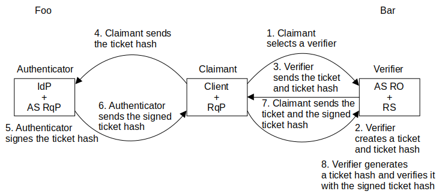
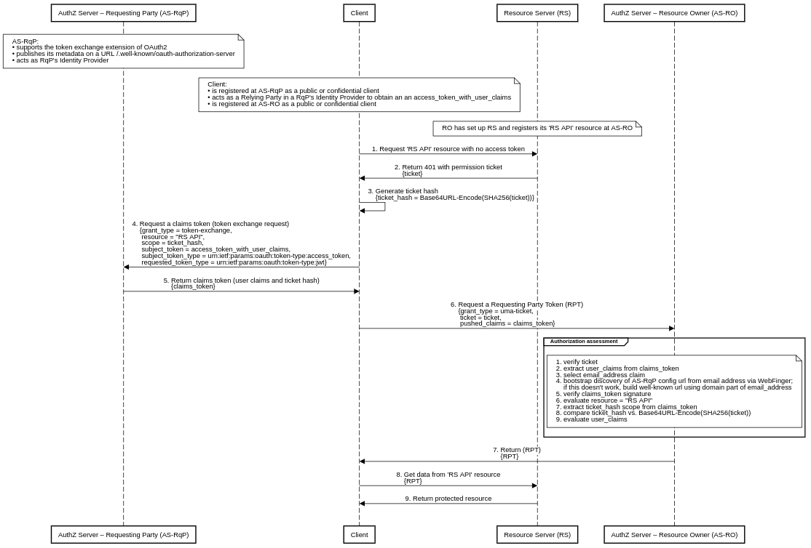

# UMA Correlated Authorization

## Abstract

UMA Correlated Authorization is a dual-authority authorization protocol built on top of [User-Managed Access (UMA)][1] and [OAuth2][2] protocols that allows users (resource owners) to delegate access to other users (requesting parties) across security domain boundaries. The requesting party is responsible for creating the request, while the resource owner approves this request either when it is online or by creating a policy. The resource owner and the requesting party belong to different security domains administered by the respective authorities. This concept uses a permission ticket issued by the resource owner's authorization server as a correlation handle that binds the requesting party's claims to the authorization process. An email address is used as the unique requesting party identifier for cross-domain access control. The intrinsic challenge-response authentication protocol elevates trust between the resource owner's authorization server and requesting party's identity provider.

## Introduction

With the growing popularity of protocols based on the OAuth2 specification, there is a need for an interoperable standard that specifies how to convey information about the user from an identity provider to an authorization server, especially across security domain boundaries. The problem is that such a system is difficult to design because OAuth2, OIDC and UMA are single-authority protocols. This draft profiles and combines the OAuth2 and UMA protocols into a dual-authority protocol, which not only meets the needs of interoperability, but also elevates trust between mutually unknown parties.

## Motivation

UMA Correlated Authorization is an attempt to revive UMA WG's original idea – [UMA wide ecosystem][5], when the resource owner and requesting party might "know each other" in the real world, but the resource owner's authorization server has no pre-established trust with the requesting party or any of their identity/claims providers – in other words, when the resource owner's authorization server and requesting party's identity provider don't know each other.

## UMA Wide Ecosystem Concept

This high-level view gives you an idea of relationships between UMA wide ecosystem entities. The authority Foo and Bar may or may not be the same authority.

## Challenge-Response Authentication Concept

This unilateral entity authentication protocol elevates trust between the resource owner's authorization server and requesting party's identity provider. The authority Foo and Bar may or may not be the same authority.

The ticket represents a random challenge and the signed ticket hash represents the response. The hash of the ticket has to be there in order not to reveal the UMA permission ticket to the authenticator.

## Sequence Diagrams

The following sequence diagrams describe the mechanism of the UMA Correlated Authorization protocol, which relies on the token exchange extension of OAuth2, where an access token is used to obtain a claims token from the Security Token Service (STS) endpoint.

### UMA Profile

This diagram represents a profile of the UMA protocol and is in full compliance with the UMA 2.0 specification.

Prerequisites:

* The AS-RqP supports the [OAuth 2.0 Token Exchange][3] extension of OAuth2.
* The AS-RqP also acts as RqP's Identity Provider.
* The AS-RqP publishes its metadata on a URL /.well-known/oauth-authorization-server (alternatively on /.well-known/openid-configuration).
* The client is registered at the AS-RqP as a public or confidential client and acts as a Relying Party in a RqP's Identity Provider to obtain an access token with user claims.
* The client is registered at the AS-RO as a public or confidential client.
* The RO has set up the RS and registers its 'RS API' resource at the AS-RO according to the [UMA Federated Authorization][4] specification.

Steps:

1. The RqP directs the client to access the 'RS API' resource with no access token.
2. Without an access token, the RS will return HTTP code 401 (Unauthorized) with a permission ticket.
3. The client generates a ticket hash derived from the permission ticket using the following transformation ticket_hash = Base64URL-Encode(SHA256(ticket)).
4. At the AS-RqP the client requests a claims token by presenting the access token with user claims and the generated ticket hash.
5. The AS-RqP returns the claims token.
6. At the AS-RO the client requests an RPT by presenting the claims token and the permission ticket.
7. After an authorization assessment, it is positive, the AS-RO returns RPT.
8. With the valid RPT the client tries to access the 'RS API'.
9. The RS validates the RPT, it is valid, the RS allow access the protected 'RS API' resource.

[1]: https://en.wikipedia.org/wiki/User-Managed_Access
[2]: https://datatracker.ietf.org/doc/html/rfc6749
[3]: https://www.rfc-editor.org/rfc/rfc8693.html
[4]: https://docs.kantarainitiative.org/uma/wg/rec-oauth-uma-federated-authz-2.0.html
[5]: https://kantarainitiative.org/confluence/display/uma/UMA+Roadmap+for+2016