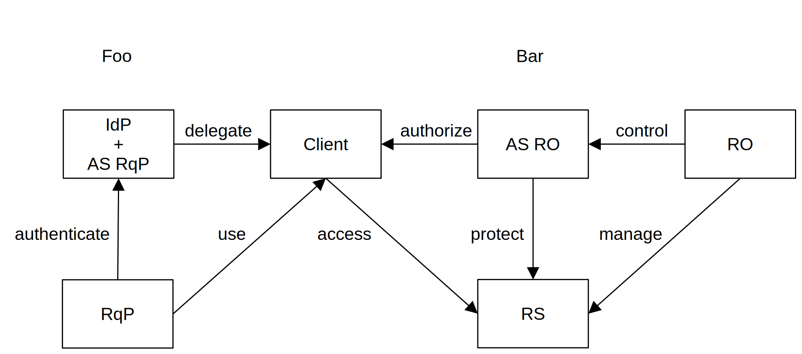
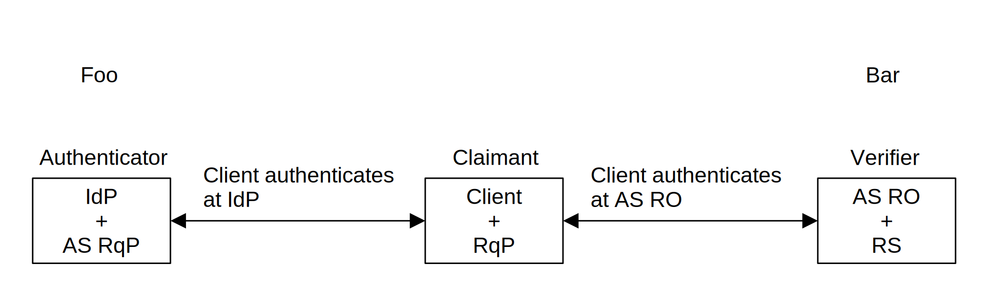

<!-- @import "style.less" -->

# Correlated Authorization—Draft

    Igor Zboran 
    izboran@gmail.com

&emsp;<strong><em>Abstract</em></strong>—Trustworthiness of data—determined by its provenance—is fundamental to the cybersecurity of the Internet as a whole. As business boundaries are redrawn, it is becoming increasingly clear that a flexible, trust framework is needed to support the digital economy.

&emsp;This paper introduces Correlated Authorization as a dual-authority trust framework built on top of User-Managed Access (UMA) [1, 2] and OAuth 2.0 [3, 4] protocols that allow users (resource owners) to delegate access to other users (requesting parties) across the security domain boundaries. The requesting party is responsible for creating the request, while the resource owner approves this request either when it is online or by creating a policy. The resource owner and the requesting party may belong to different security domains administered by the respective authorities.

&emsp;The proposed concept uses a permission ticket issued by the resource owner's authorization server as a correlation handle that binds the requesting party's claims to the authorization process. An email address is used as the unique requesting party identifier. The requesting party authenticates to the resource owner's authorization server using a challenge-response authentication protocol, while the holder-of-key assertion mechanism establishes trust between the respective authorities. On the requesting party side, Correlated Authorization uses the token exchange extension of the OAuth 2.0 protocol [4] as a counterpart to the UMA protocol.

## I. Introduction

&emsp;With the growing popularity of protocols based on the OAuth 2.0 [3] specification, there is a need for an interoperable standard that specifies how to convey information about the user from an identity provider to an authorization server, especially across security domain boundaries. The problem is that such a system is difficult to design because OAuth 2.0 [3], OIDC [5], and UMA are single-authority protocols. This draft profiles and combines the OAuth 2.0 and UMA protocols into a dual-authority framework, which not only meets the needs of interoperability but also establishes trust between mutually unknown parties.

## II. Motivation

&emsp;Correlated Authorization is an attempt to revive UMA WG's original idea—UMA wide ecosystem [6] when the resource owner and the requesting party might "know each other" in the real world, but the resource owner's authorization server has no pre-established trust with the requesting party or any of their identity/claims providers—in other words when the resource owner's authorization server and requesting party's identity provider do not know each other.

## III. UMA Wide Ecosystem Concept

&emsp;This high-level view illustrated in Figure&nbsp;1 gives you an idea of relationships between UMA wide ecosystem entities.

UMA uses special jargon. For the sake of brevity of this paper, the following list of acronyms will be used:

* IdP - Identity Provider
* AS - Authorization Server
* RS - Resource Server
* RO - Resource Owner
* RqP - Requesting Party
* PAT - Protection API Access Token
* RPT - Requesting Party Token

Fig.&nbsp;1.&emsp;Relationships between UMA wide ecosystem entities

The UMA wide ecosystem concept uses relationship-driven policies to drive automated dual-authority trust assessment and token issuance. The relationship-driven policies incorporate user-to-user (U2U) relationships and user-to-resource (U2R) relationships.

## IV. Challenge-Response Authentication Protocol

&emsp;Figure&nbsp;2 shows the unilateral entity authentication protocol [7] adapted for the Correlated Authorization framework that links an authenticator with the verifier through the client and allows the claimant to convey identity information to the verifier.

Fig.&nbsp;2.&emsp;Unilateral entity authentication protocol

* The authenticator is represented by the requesting party's identity provider and the requesting party's authorization server.
* The verifier is represented by the resource owner's authorization server and the resource owner's resource server.
* The claimant represents a principal which communicates with both the authenticator and the verifier using a client.

&emsp;Successful completion of steps means that the claimant has authenticated himself to the verifier. The ticket represents the random challenge, and the signed ticket hash together with the ticket represents the response. Ticket hash is used here to ensure that the actual value of the ticket is not disclosed to the authenticator.

## V. Federation and Assertions

&emsp; The Correlated Authorization framework uses a multiparty federation protocol, as illustrated in Figure&nbsp;3. There are some similarities and a few differences between the Correlated Authorization federation scenario and the federation scenario described in NIST SP 800-63C [8] document.

Fig.&nbsp;3.&emsp;Multiparty federation protocol

#### *A. Federation Model*

&emsp;Two two-party relationships are formed in a Correlated Authorization federation protocol, as shown in Figure&nbsp;3. The first one is between the claimant and the authenticator, pre-established, e.g., by a dynamic registration. The second one is between the claimant and the verifier, also pre-established, e.g., by a dynamic registration. The claimant communicates with both the authenticator and the verifier using a client. The verifier and the authenticator communicate with each other through the client, which acts as a token propagator that propagates tokens from the authenticator to the verifier.

&emsp;Authenticator may establish whitelists of verifiers authorized to receive authentication, and verifiers may establish whitelists of authenticators that the verifier will accept authentication. Authenticators may also establish blacklists of verifiers not authorized to receive authentication, and verifiers may also establish blacklists of authenticators that the verifier will not accept authentication.

#### *B. Assertions*

&emsp;According the UMA Grant specification [1], Section 3.3.1, the potential types of claim token formats are ID Tokens and SAML assertion. The Correlated Authorization framework uses the urn:ietf:params:oauth:token-type:jwt format for the pushed claims tokens. To prove that the claimant is the rightful subject of the assertion the holder-of-ticket assertion is used, which contains a hash value of the ticket possessed by the claimant. 

&emsp;According the RFC7521 [9] "Assertion authorization grants may be used with or without client authentication or identification. Whether or not client authentication is needed in conjunction with an assertion authorization grant, as well as the supported types of client authentication, are policy decisions at the discretion of the authorization server.". It follows that the UMA grant with assertions may be used without client authentication. This only applies for specific scenarios. Be careful.

## VI. Sequence Diagram

&emsp;The following sequence diagram describes the mechanism and policies of the Correlated Authorization framework, which utilizes the UMA protocol with the token exchange extension of OAuth 2.0 [4], where an access token is used to obtain an identity claims token from the Security Token Service (STS) endpoint.

#### *A. UMA Profile*

&emsp;The sequence diagram (see Appendix A for a detailed diagram) illustrated in Figure&nbsp;4 represents a profile of the UMA protocol and is in full compliance with the UMA 2.0 specification.

Fig.&nbsp;4.&emsp;Correlated Authorization sequence diagram — UMA profile

Prerequisites:

* The AS-RqP URI and domain part of the RqP's email address must match.
* The AS-RqP provides an STS service that supports the Token Exchange extension of OAuth 2.0.
* The client is registered at AS-RqP as a public or confidential client.
* The client acts as a Relying Party in respect of the RqP's Identity Provider in order to obtain an access_token_with_user_claims.
* The client is registered at AS-RO as a public or confidential client.
* The client acts as a token propagator between the AS-RqP and AS-RO.
* The RO has set up the RS, registers the resources at the AS-RO and sets policies.
* The AS-RO URI and domain part of the RO's email address must match.
* The AS-RO provides an STS service that supports the Token Exchange extension of OAuth 2.0

Steps:

1. The RqP directs the client to access the resource URI, e.g. to get or post data, with no access token.
2. Using a valid PAT the RS requests a permission ticket and resource claims token. <dl><dt></dt><dd>The AS-RO generates the permission_ticket (a JWT with a random NONCE value in the sub claim)
and the resource_claims_token which is bound to the permission_ticket through the permission_ticket sub claim hash. The resource claims token contains these claims: 
{iss,&nbsp;ts,&nbsp;aud,&nbsp;sub,&nbsp;exp,&nbsp;nbf} 
where 
-&nbsp;iss is the URI that identifies who issues the resource_claims_token  
-&nbsp;aud is the URI that identifies the requested resource 
-&nbsp;sub is the permission_ticket sub claim hash computed as Base64URL-Encode(SHA256(permission_ticket{sub}) 
-&nbsp;exp, nbf are the standard JWT claims) 
The resource claims token is not mentioned in the UMA specification. A detailed description of the resource claims token format is out of the scope of this paper.</dd></dl>
3. The AS-RO returns the permission ticket and resource claims token.
4. Without an access token, the RS will return HTTP code 401 (Unauthorized) with the permission ticket and resource claims token, issued_token_type = urn:ietf:params:oauth:token-type:jwt.
5. The client requests an identity claims token by presenting the access token with user claims, resource claims token, and RO's email address URI (optional). <dl><dt></dt><dd>{grant_type&nbsp;=&nbsp;token-exchange,
&nbsp;requested_token_type&nbsp;=&nbsp;urn:ietf:params:oauth:token-type:jwt,
&nbsp;resource&nbsp;=&nbsp;(RO's email address URI) — optional,
&nbsp;scope&nbsp;=&nbsp;resource_claims_token,
&nbsp;subject_token&nbsp;=&nbsp;access_token_with_user_claims,
&nbsp;subject_token_type&nbsp;=&nbsp;urn:ietf:params:oauth:token-type:access_token,
&nbsp;requested_token_type&nbsp;=&nbsp;urn:ietf:params:oauth:token-type:jwt} 
The AS-RqP performs an authorization assessment:
&nbsp;1.&nbsp;verify the resource_claims_token signature
&nbsp;2.&nbsp;evaluate the subject_token claims
&nbsp;3.&nbsp;verify the actor_token signature
&nbsp;4.&nbsp;evaluate the actor claims 
&nbsp;5.&nbsp;verify the resource parameter value — optional 
After a trust assessment, it is positive, the AS-RqP generates the identity_claims_token with these claims: 
{iss,&nbsp;aud,&nbsp;sub,&nbsp;exp,&nbsp;nbf,&nbsp;act{sub}} 
where 
-&nbsp;iss is the URI that identifies who issues the identity_claims_token
-&nbsp;aud identifies the target service and it is the iss claim value extracted from the actor_token
-&nbsp;sub identifies the RqP by email address and was extracted from the access_token_with_user_claims
-&nbsp;exp, nbf are the standard JWT claims
-&nbsp;act{aud} is the the resource parameter value — optional
-&nbsp;act{sub} is the sub value extracted from the actor_token</dd></dl>
6. The AS-RqP the identity_claims_token in the access_token parameter, issued_token_type&nbsp;=&nbsp;urn:ietf:params:oauth:token-type:jwt.
7. At the AS-RO the client requests an RPT by presenting the identity claims token and the permission ticket. <dl><dt></dt><dd>{grant_type&nbsp;=&nbsp;uma-ticket,
&nbsp;ticket&nbsp;=&nbsp;permission_ticket,
&nbsp;claim_token&nbsp;=&nbsp;identity_claims_token,
&nbsp;claim_token_format = urn:ietf:params:oauth:token-type:jwt} 
The AS-RO performs an authorization assessment:
&nbsp;1.&nbsp;verify the permission ticket signature
&nbsp;2.&nbsp;evaluate the permission_ticket claims
&nbsp;3.&nbsp;verify the identity_claims_token signature
&nbsp;4.&nbsp;evaluate the identity claims
&nbsp;5.&nbsp;identity_claims_token{act{aud}} and the RO's email address URI must match — optional
&nbsp;6.&nbsp;identity_claims_token{act{sub}} and Base64URL-Encode(SHA256(permission_ticket{sub})) must match</dd></dl>
After a trust assessment, it is positive, the AS-RO generates the access token with the RqP's email address sub claim
(though the RqP is not signed in, the client acts on behalf of RqP) and with the additional RPT claim:
{permissions}
permissions, all permissions granted by the authorization server
8. The AS-RO returns RPT and optionally a refresh token.
9. With the valid RPT the client tries to access the resource URI to get or post data.
The RS validates the RPT; it is valid, the RS allows access to the protected resource.
10. The RS return the HTTP response, typically with 200, 201 status code.

#### *B. OAuth Profile*

&emsp;The self-explanatory sequence diagram in Appendix B represents profile of the OAuth 2.0 protocol.

## VII. Coarse-Grained Authorization

&emsp;The centralized AS-RqP policy verifies the provenance of the resource claims in order to issue the identity claims token. The centralized AS-RO policy verifies the provenance of the identity claims in order to issue the requesting party token. The authorization decisions are made at the resource owner's authorization server and the requesting party's authorization server using an Attribute-Based Access Control (ABAC) system, which is shown in Figure&nbsp;5.

Fig.&nbsp;5.&emsp;Attribute-Based Access Control system

The input of the ABAC system is grouped into four categories:

* Subject attributes about the user making request, taken from the access token or identity claims token.
* Resource attributes about the resource being accessed, taken from resource claims token or defined by the ticket.
* Action attributes about the HTTP request method (GET, POST, PUT, DELETE).
* Attributes about the context in which the operation is taking place, e.g., level of assurance.

The output of the ABAC system is an allow or deny decision.

## VIII. Fine-Grained Access Control

&emsp;To avoid overloading the authorization server, information about which user has access to which resources, together with a set of permissions that define what each user can do, should be stored on the resource server in the access control list (ACL). ACLs should be managed through the resource server API. It is also possible to use a local ABAC engine on the resource server, where the Policy Decision Point (PDP) can go through the ACL and the Policy Information Points (PIP) can use groups or roles resolved from the RPT. Given that, the final authorization decision is made on the resource server.

## IX. Authority Boundaries, Interactions, and Scenarios

&emsp;The Correlated Authorization framework allows us to indirectly (through the client) link identity providers with authorization servers governed by different authorities that are not required to share information or collaborate. The following scenarios demonstrate a system of trust between multiple authorities that allows the conveyance of identity information from identity providers to authorization servers across the security domain boundaries.

#### *A. Identity Federation Scenario*

&emsp;The scenario illustrated in Figure&nbsp;6 allows you to link a single authorization server to multiple identity providers. The client falls under the governance of the resource owner's respective authority.

Fig.&nbsp;6.&emsp;Identity federation scenario

&emsp;The identity federation with many-to-one topology uses third-party identity providers. The requesting party can operate across resource servers governed by a single resource owner's respective authority.

#### *B. Data Federation Scenario*

&emsp;The data federation scenario illustrated in Figure&nbsp;7 allows you to link a single identity provider to multiple authorization servers. The client falls under the governance of the requesting party's respective authority.

Fig.&nbsp;7.&emsp;Data federation scenario

&emsp;The data federation with one-to-many topology uses third-party authorization servers. The requesting party can operate across many resource servers, each of which is governed by a different respective authority of resource owners.

#### *C. Mesh Federation Scenario*

&emsp;As the name suggests, the scenario illustrated in Figure&nbsp;8 allows multiple authorization servers to be linked to multiple identity providers. The client does not fall under the governance of the resource owner's respective authority nor the requesting party's respective authority.

Fig.&nbsp;8.&emsp;Mesh federation scenario

&emsp;The mesh federation with many-to-many topology uses third-party identity providers and third-party authorization servers. The requesting party can operate across many resource servers governed by many resource owners' respective authorities.

## X. Applications and Use Cases

&emsp;The Correlated Authorization framework may be used to secure cross-domain data exchange systems. Furthermore, file sharing, instant messaging, teleconferencing. Also, Healthcare systems, Fintech, and Telco services.

## XI. Conclusion and Future Work

&emsp;The UMA philosophy of the resource owner and the requesting party projected onto the Correlated Authorization trust framework matches the philosophy of the sender and recipient of the mail system. The following are potential future R&D areas:

1. Explore authentication methods of unregistered clients.
2. Evaluate other ways of data origin authenticity (WebFinger, DKIM). Use the DKIM signed email in a claims token as an expedient way to convey some asserted attributes about the sender (alternatively, after forwarding, about the recipient also).
3. Write the Correlated Authorization feamework RFC.

&emsp;The ability to dynamically establish ephemeral trust between the requesting party and the resource owner's resources makes the Correlated Authorization framework compatible with the Zero Trust concept.

&emsp;A prototype implementation of the proposed framework, working as a proof of concept, would be interesting to build.

## Acknowledgment

&emsp;This work has benefited from the valuable discussions with Eve Maler, founder of WG-UMA [10], and Alec Laws, chair of WG-UMA [10]. Both gave feedback that improved this paper's content. Last but not least, the UMA Work Group archives [11, 12] serve as a source of comprehensive information on authorization-related topics—many thanks to all involved.

## References

[1]&nbsp;E. Maler, M. Machulak, J. Richer, and T. Hardjono, "User-Managed Access (UMA) 2.0 Grant for OAuth 2.0 Authorization," Internet Engineering Task Force (2019), https://docs.kantarainitiative.org/uma/wg/rec-oauth-uma-grant-2.0.html. 
[2]&nbsp;E. Maler, M. Machulak, J. Richer, and T. Hardjono, "Federated Authorization for User-Managed Access (UMA) 2.0," Internet Engineering Task Force (2019), https://docs.kantarainitiative.org/uma/wg/rec-oauth-uma-federated-authz-2.0.html. 
[3]&nbsp;E. D. Hardt, "The OAuth 2.0 Authorization Framework," IETF RFC 6749 (Informational), 2012, http://tools.ietf.org/html/rfc6749. 
[4]&nbsp;M. Jones, A. Nadalin, B. Campbell, J. Bradley, C. Mortimore, "OAuth 2.0 Token Exchange," RFC 8693 (2020), https://rfc-editor.org/rfc/rfc8693.txt. 
[5]&nbsp;OpenID specifications at "OpenID Foundation," 2022, https://openid.net/developers/specs/. 
[6]&nbsp;"UMA telecon 2016-03-31," https://kantarainitiative.org/confluence/display/uma/UMA+telecon+2016-03-31 
[7]&nbsp;National Institute of Standards and Technology, "FIPS PUB 196: Entity Authentication Using Public Key Cryptography," 1997. [Online]. Available: https://csrc.nist.gov/csrc/media/publications/fips/196/archive/1997-02-18/documents/fips196.pdf. 
[8]&nbsp;"Digital Identity Guidelines: Federation and Assertions", NIST Special Publication 800-63C, June 2017, https://nvlpubs.nist.gov/nistpubs/SpecialPublications/NIST.SP.800-63c.pdf. 
[9]&nbsp;Campbell, B., Mortimore, C., Jones, M., and Y. Goland, "Assertion Framework for OAuth 2.0 Client Authentication and Authorization Grants", RFC 7521, DOI 10.17487/RFC7521, May 2015, http://www.rfc-editor.org/info/rfc7521.. 
[10]&nbsp;"User-Managed Access" Work Group at "Kantara Initiative," https://kantarainitiative.org/confluence/display/uma/Home. 
[11]&nbsp;"The WG-UMA Archives," https://kantarainitiative.org/pipermail/wg-uma/. 
[12]&nbsp;"Kantara Initiative User-Managed Access WG," https://groups.google.com/g/kantara-initiative-uma-wg. 

<h2>Appendix A.</h2>

 

<h2>Appendix B.</h2>

